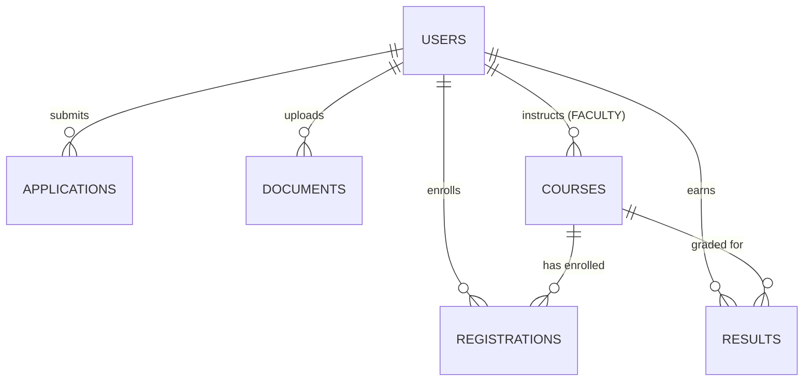

# 🏛️ University Admission & Course Registration System — Database Schema Design

This document details the complete MongoDB database architecture, Mongoose schemas, data types, constraints, validation rules, indexes, and relationship integrity models for **`universityDB`**.

---

## 📌 Database Overview
- **Database Engine**: MongoDB (v6.0+)
- **Database Name**: `universityDB`
- **Connection URI**: `mongodb://127.0.0.1:27017/universityDB`
- **ORM / ODM**: Mongoose v8.x
- **Authentication**: JWT token with bcrypt salted password hashing (work factor 10)



---

## 🗃️ Collection Specifications

### 1. `users` Collection
Stores authentication credentials, user profiles, and role definitions across the institution.

| Field Name | Type | Required | Constraints / Default | Description |
| :--- | :--- | :--- | :--- | :--- |
| `_id` | `ObjectId` | Yes | Auto-generated / Deterministic | Primary Key |
| `name` | `String` | Yes | `trim: true` | Full legal name of user |
| `email` | `String` | Yes | `unique: true, lowercase: true, regex match` | Primary login credential |
| `password` | `String` | Yes | `minlength: 6` | Bcrypt-hashed password |
| `role` | `String` | Yes | Enum: `['STUDENT', 'FACULTY', 'ADMIN', 'ADMISSION_OFFICER']` | Role-based authorization tier |
| `createdAt` | `Date` | No | Default: `Date.now` | Account creation timestamp |
| `updatedAt` | `Date` | No | Timestamp | Last record update timestamp |

#### Indexes:
- `{ email: 1 }` (**Unique**): Guarantees email exclusivity for authentication.
- `{ role: 1 }`: Optimizes role-based directory queries and permission filters.

---

### 2. `applications` Collection
Maintains admission applications, applicant qualifications, academic scores, and admission officer review decisions.

| Field Name | Type | Required | Constraints / Default | Description |
| :--- | :--- | :--- | :--- | :--- |
| `_id` | `ObjectId` | Yes | Auto-generated | Primary Key |
| `studentId` | `ObjectId` | Yes | `ref: 'User'` | Foreign Key referencing `users._id` |
| `applicantName`| `String` | No | `trim: true` | Applicant name for dossier lookups |
| `email` | `String` | No | `trim: true, lowercase: true` | Applicant contact email |
| `program` | `String` | Yes | `trim: true` | Applied degree program (e.g. CSE) |
| `term` | `String` | No | Default: `'Fall 2026'` | Target enrollment term |
| `previousQualification` | `String` | No | `trim: true` | Previous schooling / standard |
| `percentage` | `Number` | No | `min: 0, max: 100` | Academic score or aggregate % |
| `status` | `String` | Yes | Enum: `['PENDING', 'UNDER_REVIEW', 'APPROVED', 'REJECTED']` | Status of admission application |
| `submittedAt` | `Date` | No | Default: `Date.now` | Submission timestamp |
| `reviewedAt` | `Date` | No | `null` until reviewed | Decision timestamp |
| `reviewedBy` | `ObjectId` \| `String` | No | `ref: 'User'` | Admission officer who evaluated dossier |
| `rejectionReason` | `String` | No | `trim: true` | Explanatory note if application rejected |

#### Indexes:
- `{ studentId: 1 }`: Instant dossier retrieval for logged-in students.
- `{ status: 1, submittedAt: -1 }`: Optimizes admission officer queues sorted by submission date.

---

### 3. `documents` Collection
Tracks uploaded identity proofs, marksheets, certificates, and photos with verification workflows.

| Field Name | Type | Required | Constraints / Default | Description |
| :--- | :--- | :--- | :--- | :--- |
| `_id` | `ObjectId` | Yes | Auto-generated | Primary Key |
| `studentId` | `ObjectId` | Yes | `ref: 'User'` | Foreign Key referencing `users._id` |
| `documentType` | `String` | Yes | Enum: `['AADHAAR', 'MARKSHEET', 'TRANSFER_CERTIFICATE', 'PHOTO', 'OTHER', ...]` | Category of uploaded document |
| `fileName` | `String` | No | `trim: true` | Stored file name on disk/S3 |
| `originalName` | `String` | No | `trim: true` | Original client file name |
| `fileUrl` | `String` | Yes | `trim: true` | Relative/absolute static asset path |
| `fileSize` | `Number` \| `String` | No | `fileSize` in bytes or formatted string | File size metric |
| `mimeType` | `String` | No | `application/pdf`, `image/jpeg`, etc. | Content MIME category |
| `status` | `String` | Yes | Enum: `['PENDING', 'VERIFIED', 'REJECTED']` | Verification state |
| `verified` | `Boolean` | No | Default: `false` | Quick boolean flag |
| `uploadedAt` | `Date` | No | Default: `Date.now` | Upload timestamp |
| `verifiedBy` | `ObjectId` | No | `ref: 'User'` | Officer who verified document |
| `verifiedAt` | `Date` | No | Date | Verification decision date |

#### Indexes:
- `{ studentId: 1 }`: Fast retrieval of student document bundles.
- `{ status: 1 }`: Efficient filtering for unverified / pending verification queues.

---

### 4. `courses` Collection
Defines canonical university courses, instructor allocations, maximum classroom seating capacities, prerequisite chains, and weekly timetable schedules.

| Field Name | Type | Required | Constraints / Default | Description |
| :--- | :--- | :--- | :--- | :--- |
| `_id` | `ObjectId` | Yes | Auto-generated | Primary Key |
| `code` | `String` | Yes | `unique: true, uppercase: true, trim: true` | Canonical course code (e.g. `CS301`) |
| `name` | `String` | Yes | `trim: true` | Full course title |
| `capacity` | `Number` | Yes | `min: 1` | Maximum enrolled seats (e.g. `40`) |
| `facultyId` | `ObjectId` | No | `ref: 'User'` | Instructor referencing `users._id` (role: FACULTY) |
| `faculty` | `String` | No | Default: `'Faculty Member'` | Faculty name display |
| `prerequisites` | `[String]` | No | Default: `[]` | Array of prerequisite course codes required (e.g. `['ML301']`) |
| `credits` | `Number` | No | Default: `3` | Course credit unit weighting |
| `schedule.day` | `String` | Yes | Enum: Weekdays | Lecture day (e.g. `'Monday'`) |
| `schedule.start` | `String` | Yes | Regex: `^([01]\d\|2[0-3]):([0-5]\d)$` | 24-hr Start Time (`'10:00'`) |
| `schedule.end` | `String` | Yes | Regex: `^([01]\d\|2[0-3]):([0-5]\d)$` | 24-hr End Time (`'11:00'`) |

#### Indexes:
- `{ code: 1 }` (**Unique**): Prevents duplicate course catalog entries.
- `{ name: 1 }`: Fast catalog search by title.
- `{ facultyId: 1 }`: Faculty dashboard lookup for assigned courses.
- `{ 'schedule.day': 1, 'schedule.start': 1 }`: Conflict and slot allocation index.

---

### 5. `registrations` Collection
Tracks student course enrollment, real-time waitlist FIFO queues, and drop histories.

| Field Name | Type | Required | Constraints / Default | Description |
| :--- | :--- | :--- | :--- | :--- |
| `_id` | `ObjectId` | Yes | Auto-generated | Primary Key |
| `studentId` | `ObjectId` | Yes | `ref: 'User'` | Foreign Key referencing `users._id` |
| `courseId` | `ObjectId` | Yes | `ref: 'Course'` | Foreign Key referencing `courses._id` |
| `status` | `String` | Yes | Enum: `['ENROLLED', 'WAITLISTED', 'REJECTED', 'DROPPED']` | Enrollment state |
| `waitlistPosition` | `Number` | No | Default: `null` | 1-based FIFO queue position |
| `semester` | `String` | No | Default: `'Fall 2026'` | Active academic term |
| `registeredAt` | `Date` | No | Default: `Date.now` | Timestamp of enrollment request |

#### Indexes:
- `{ studentId: 1, courseId: 1 }` (**Unique**): Guarantees a student cannot have duplicate active registrations for the same course.
- `{ courseId: 1, status: 1 }`: Rapid aggregation of seat counts and waitlist depth.
- `{ studentId: 1 }`: Student timetable and registered course loading.

---

### 6. `results` Collection
Stores student grades, marks, published transcripts, and historical course completions for prerequisite validations.

| Field Name | Type | Required | Constraints / Default | Description |
| :--- | :--- | :--- | :--- | :--- |
| `_id` | `ObjectId` | Yes | Auto-generated | Primary Key |
| `studentId` | `ObjectId` | Yes | `ref: 'User'` | Foreign Key referencing `users._id` |
| `studentName` | `String` | No | `trim: true` | Student name cache |
| `courseId` | `ObjectId` | Yes | `ref: 'Course'` | Foreign Key referencing `courses._id` |
| `courseCode` | `String` | No | `uppercase: true` | Course code (e.g. `'ML301'`) |
| `courseName` | `String` | No | `trim: true` | Course name cache |
| `marks` | `Number` | No | `min: 0, max: 100` | Numerical score (0–100) |
| `grade` | `String` | No | Enum: `['A+', 'A', 'A-', 'B+', 'B', 'B-', 'C+', 'C', 'C-', 'D', 'F']` | Letter grade |
| `gradePoint` | `Number` | No | Default: `4.0` | 4.0 scale GPA grade point |
| `credits` | `Number` | No | Default: `3` | Credits earned |
| `semester` | `String` | No | Default: `'Spring 2026'` | Term when course was completed |
| `status` | `String` | Yes | Enum: `['COMPLETED', 'IN_PROGRESS', 'PUBLISHED', 'DRAFT']` | Result state |
| `publishedAt` | `Date` | No | Date | Publication timestamp |

#### Indexes:
- `{ studentId: 1, courseId: 1 }` (**Unique**): Single official grading entry per student per course.
- `{ studentId: 1, status: 1 }`: Prerequisite engine query for `status: 'COMPLETED'`.

---

## 🔒 Referential Integrity & Foreign Key Map

```
applications.studentId    --> users._id (role: STUDENT)
applications.reviewedBy   --> users._id (role: ADMISSION_OFFICER)
documents.studentId       --> users._id (role: STUDENT)
documents.verifiedBy      --> users._id (role: ADMISSION_OFFICER)
courses.facultyId         --> users._id (role: FACULTY)
registrations.studentId   --> users._id (role: STUDENT)
registrations.courseId    --> courses._id
results.studentId         --> users._id (role: STUDENT)
results.courseId          --> courses._id
```
